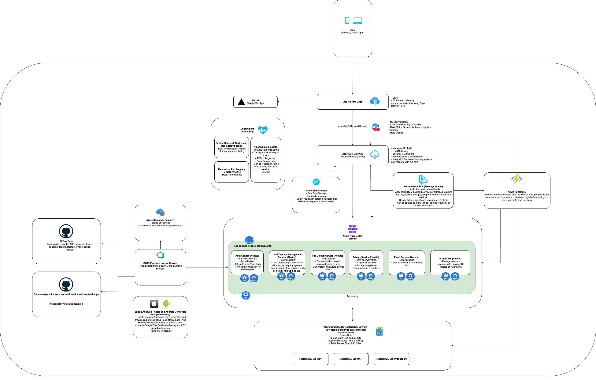

## Executive Summary

### Overview

This proposal presents a comprehensive plan for the development of a responsive website and a mobile application designed to serve a wide range of audiences across ten different countries. The project is divided into two phases, with Phase 1 focusing on the responsive website and Phase 2 on the mobile application. Our goal is to create a seamless and engaging digital experience that accommodates multilingual support, ensures data privacy, and integrates smoothly with third-party systems.

### Key Objectives

- **Develop a Responsive Website:** Create a user-friendly website that adjusts seamlessly across various devices, ensuring a consistent user experience.
- **Implement Multilingual Support:** Provide language options to cater to audiences in ten different countries, enhancing accessibility and user engagement.
- **Effective Lead Capture and Management:** Design and implement robust lead capture mechanisms, with data routed to appropriate systems based on lead type and origin.
- **Data Privacy Compliance:** Ensure that all lead data is stored securely and in compliance with local data privacy laws, with contingencies for delivery failures.
- **Integration with Third-Party Systems:** Enable real-time data feed from third-party systems to keep the content fresh and relevant.
- **Adhere to Accessibility and Performance Standards:** Meet WCAG 2.2 AA standards and achieve high scores on Google Lighthouse metrics for accessibility, SEO, and performance.
- **Content Management System (CMS):** Select and integrate a CMS for managing multilingual content efficiently.
- **Structured Schema Data and Social Meta Data:** Implement structured schema data to enhance SEO and use social meta tags for better social media integration.
- **Anti-Spam and Security Controls:** Implement measures such as CAPTCHA, HTTPS, and security libraries to protect against spam and security threats.
- **Mobile Experience:** Leverage device and OS features to enhance the mobile user experience, ensuring support for accessibility features.
- **Logging and Alerting Strategy:** Collect logs and diagnostic data, and implement a robust alerting system to monitor performance and detect issues.

### Strategic Benefits

- **Enhanced User Engagement:** By providing a responsive, multilingual platform, we cater to a global audience, improving user satisfaction and retention.
- **Increased Lead Conversion:** Efficient lead capture and management processes ensure higher conversion rates and better customer relationship management.
- **Regulatory Compliance:** Adherence to local data privacy laws builds trust with users and mitigates legal risks.
- **Competitive Advantage:** High accessibility and performance standards position the platform as a leader in inclusivity and user experience.
- **Scalability and Flexibility:** The architecture is designed to support future enhancements and expansions, ensuring long-term viability and growth potential.

## High-Level Architecture

# Solution Architecture Explanation

## Architecture and Technologies

The proposed architecture leverages a modern, scalable, and resilient technology stack designed to handle incoming data feeds, ensure reliable message delivery, and provide a seamless user experience across web and mobile platforms. The core components of the architecture include:

### Frontend

- **Responsive Website:** Built with Next.js and hosted on Vercel, providing server-side rendering for improved performance and SEO.
- **Mobile Application:** Developed using React Native, ensuring a consistent user experience across iOS and Android devices.

### API Gateway

- **Azure API Management:** Used as the API Gateway, which manages API traffic, provides load balancing, enforces security policies, and integrates with various backend services.

### Backend

- **Kubernetes Cluster:** Backend services are containerized and orchestrated using Azure Kubernetes Service (AKS). The API layer, business logic, and Strapi CMS run within Kubernetes, ensuring scalability and high availability.

### Content Management System (CMS)

#### Selection and Integration

- Use a headless CMS like Strapi for content management.
- The Strapi CMS will manage multilingual content through the internationalization feature, ensuring easy updates and consistency across different languages. On the frontend, the user can select the language they want and the content will be displayed according to the selected langauge.
- Integration with the frontend through APIs to fetch and display content dynamically.

### Database

- **PostgreSQL:** Used as the primary database, hosted on Azure Database for PostgreSQL. It implements security measures like Row-Level Security (RLS) and Role-Based Access Control (RBAC) to protect sensitive data.

### Data Ingestion and Processing

- **Azure Service Bus:** Handles the ingestion of data feeds from third-party systems, ensuring reliable message delivery and enabling complex messaging patterns.
- **Azure Functions:** Process the data received from the Service Bus, performing any necessary transformations or business logic before storing it or passing it on to other services.

### Storage

- **Azure Blob Storage:** Used for storing raw data.
- **Azure Database for PostgreSQL Servers (Dev, staging and Prod environments):** Used for structured and globally distributed data storage.

### Integration Layer

- **API Gateway (API Management Services):** Manages integration services, routing, and secure access to backend services.

### Security and Compliance

- **Comprehensive Security Measures:** Anti-spam techniques like CAPTCHA, data encryption (in transit and at rest), data anonymization, and audit logging to ensure compliance with data privacy regulations.

### Monitoring and Logging

- **Sentry, Kibana, Google Analytics:** Provide robust monitoring and logging for the entire infrastructure, ensuring real-time insights into system performance and quick identification of issues. We can setup alerting with Kibana or Sentry for any issues that might arise in production.

### Infrastructure

- **Azure Front Door:** Used for CDN and global load balancing, ensuring fast and reliable delivery of content to users worldwide.

### Web Experience Standards

#### Structured Schema Data and Social Meta Data

- Implement structured schema data to enhance SEO and enable rich search results.
- Use Open Graph and Twitter Card metadata for better social media integration and link previews.

#### Accessibility and Performance

- Adhere to WCAG 2.2 AA standards to ensure the website is accessible to all users, including those with disabilities.
- Optimize for high scores on Google Lighthouse metrics for accessibility, SEO, and performance.

### Anti-Spam and Security Controls

#### Measures

- Implement CAPTCHA to prevent spam submissions in lead capture forms.
- Use HTTPS for all communications to ensure data security.
- Regularly update dependencies and use security libraries to mitigate common vulnerabilities.
- Employ Content Security Policy (CSP) for additional security.
- Using TLS/SSL for to encrypt all data communication.

### Mobile Experience

### Leveraging Device and OS Features

- Utilize device-specific capabilities such as GPS, camera, and push notifications to enhance the user experience.
- Ensure the mobile app supports OS-level accessibility features, such as screen readers and dynamic type.

## Simple Explanation for a Less Technical Audience

Our solution is designed to create a robust and scalable platform that caters to both web and mobile users. Here’s a simplified explanation of how it works:

1. **User Experience:**

   - We have a responsive website and a mobile app that provide a seamless user experience. The website adjusts automatically to different devices, and the mobile app works on both iOS and Android phones.

2. **Content Management:**

   - The system will include a content management system that allows content creators to easily add and update content.

3. **Data Handling:**

   - We will collect data from various third-party systems in real-time using Azure Service Bus. This data will then processed by our backend services, which perform necessary transformations and store the data securely.

4. **Security:**

   - We will implement strong security measures to protect user data. This includes preventing spam, encrypting data, and ensuring that only authorized users can access sensitive information.

5. **Scalability:**

   - The platform can handle a growing number of users and data without compromising performance. It is built on a scalable infrastructure that adjusts according to demand.

6. **Monitoring:**
   - We will continuously monitor the system to ensure it is running smoothly. If any issues arise, we will be alerted immediately so that we can address them quickly.

## Risks and Initial Threat Modeling

1. **Data Breaches:**

   - **Risk:** Unauthorized access to sensitive user data.
   - **Mitigation:** Implement strong encryption (both in transit and at rest), enforce RBAC and RLS, and conduct regular security audits.
   - **Threat Rating:** High

2. **Service Downtime:**

   - **Risk:** System outages affecting user experience.
   - **Mitigation:** Deploy services across multiple availability zones, use Azure Front Door for global load balancing, and implement auto-scaling with Kubernetes.
   - **Threat Rating:** High

3. **Data Loss:**

   - **Risk:** Loss of data due to failed transmissions or system failures.
   - **Mitigation:** Use Azure Service Bus for reliable message delivery and retries, implement robust backup and recovery processes, and ensure data is stored in redundant locations.
   - **Threat Rating:** Medium

4. **Performance Bottlenecks:**

   - **Risk:** Slow performance affecting user experience.
   - **Mitigation:** Optimize database queries, use caching strategies, monitor performance with Azure Monitor, and scale services dynamically with Kubernetes.
   - **Threat Rating:** Medium

5. **Regulatory Compliance:**

   - **Risk:** Non-compliance with data privacy regulations leading to legal issues.
   - **Mitigation:** Implement data anonymization, obtain user consent for data collection, maintain audit logs, and adhere to regulations like GDPR.
   - **Threat Rating:** Critical

6. **Denial of Service (DoS) Attacks:**
   - **Risk:** Overloading the system with traffic to make it unavailable.
   - **Mitigation:** Implement rate limiting at the API Gateway, use Azure DDoS Protection, and monitor traffic patterns for anomalies. Setup Autoscaling on the Kubernetes cluster, if the traffic is legitimate the system will scale up or down as needed.
   - **Threat Rating:** High

By addressing these risks with robust security measures and a resilient architecture, we can ensure a secure, reliable, and scalable platform for our users.
