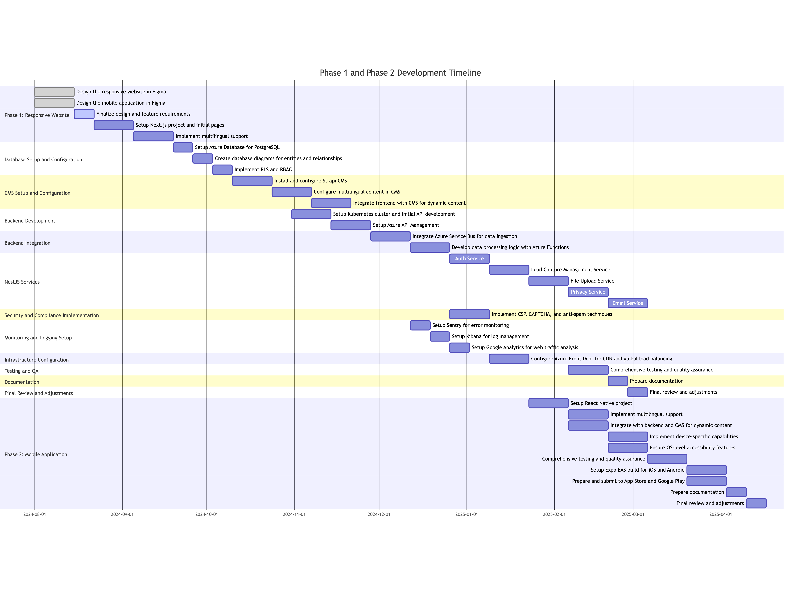

## Scope and High-Level Estimate for Development of Phase 1 and Phase 2

Phase 1 involves the development of a responsive website and the backend infrastructure to support this application. Phase 2 will focus on the development of the mobile application.
These decisions are based on assumptions about the scalability requirements of the app. It can always be scaled down to using a monolith instead of microservices and use App Services instead of Kubernetes, which would take less time to implement and manage.

## Scope of Phase 1

**UI Design**

- Design the responsive website in Figma (40 hours)
- Design the mobile application in Figma (40 hours)
- Finalize design and feature requirements (20 hours)

**Frontend Development**

- Setup Next.js project and initial pages (40 hours)
- Implement multilingual support (40 hours)

**Database Setup and Configuration**

- Setup Azure Database for PostgreSQL (20 hours)
- Create database diagrams for entities and relationships (20 hours)
- Implement RLS and RBAC (20 hours)

**CMS Setup and Configuration**

- Install and configure Strapi CMS (40 hours)
- Configure multilingual content in CMS (40 hours)
- Integrate frontend with CMS for dynamic content (40 hours)

**Backend Development**

- Setup Kubernetes cluster and initial API development (40 hours)
- Setup Azure API Management (40 hours)
- Integrate Azure Service Bus for data ingestion (40 hours)
- Develop data processing logic with Azure Functions (40 hours)

**NestJS Services**

1. **Auth Service**

   - Authentication and Authorization (40 hours)
   - Integrate with Strapi Auth (20 hours)
   - JWT Token Validation for each request (20 hours)

2. **Lead Capture Management Service**

   - Business logic (40 hours)
   - Data processing & sanitization (20 hours)
   - Routing to 3rd party systems (20 hours)
   - Interacts with other services such as Strapi, File Upload etc. (20 hours)

3. **File Upload Service**

   - Upload logic (20 hours)
   - File sanitization to prevent unwanted files (e.g., .exe) (20 hours)
   - Can interact with Azure Service Bus (20 hours)

4. **Privacy Service**

   - Data anonymization (20 hours)
   - CAPTCHA validation (20 hours)
   - Storage compliance (20 hours)
   - Delete account procedures (20 hours)

5. **Email Service**
   - Email sending (20 hours)
   - Can interact with Azure Service Bus (20 hours)

**Security and Compliance Implementation**

- Implement CSP, CAPTCHA, and anti-spam techniques (40 hours)

**Monitoring and Logging Setup**

- Setup Sentry for error monitoring (20 hours)
- Setup Kibana for log management (20 hours)
- Setup Google Analytics for web traffic analysis (20 hours)

**Infrastructure Configuration**

- Configure Azure Front Door for CDN and global load balancing (40 hours)

**Testing and QA**

- Comprehensive testing and quality assurance (80 hours)

**Documentation**

- Prepare documentation (20 hours)

**Final Review and Adjustments**

- Final review and adjustments (20 hours)

**Total Estimated Effort for Phase 1:** 960 hours

## Scope of Phase 2

**Mobile Application Development**

- Setup React Native project (40 hours)
- Implement multilingual support (40 hours)
- Integrate with backend and CMS for dynamic content (40 hours)
- Implement device-specific capabilities (40 hours)
- Ensure OS-level accessibility features (40 hours)

**Expo EAS Build and App Store Submission**

- Setup Expo EAS build for iOS and Android (40 hours)
- Prepare and submit to App Store and Google Play (40 hours)

**Testing and QA**

- Comprehensive testing and quality assurance for mobile app (80 hours)

**Documentation**

- Prepare documentation for mobile app (20 hours)

**Final Review and Adjustments**

- Final review and adjustments for mobile app (20 hours)

**Total Estimated Effort for Phase 2:** 380 hours

## Timeline for Delivery

Below is a proposed timeline for the delivery of Phase 1 and Phase 2. Each task is planned to be completed over specific weeks, assuming a team of 4 developers working 40 hours per week. The tasks are arranged to be executed in parallel where possible to optimize the timeline. The actual start date is set to August 1, 2024.

### Phase 1: Responsive Website

**Week 1-2 (August 1, 2024 - August 14, 2024)**

- Design the responsive website in Figma (40 hours)
- Design the mobile application in Figma (40 hours)

**Week 3 (August 15, 2024 - August 21, 2024)**

- Finalize design and feature requirements (20 hours)

**Week 4-5 (August 22, 2024 - September 4, 2024)**

- Setup Next.js project and initial pages (40 hours)

**Week 6-7 (September 5, 2024 - September 18, 2024)**

- Implement multilingual support (40 hours)

**Week 8-9 (September 19, 2024 - October 2, 2024)**

- Setup Azure Database for PostgreSQL (20 hours)
- Create database diagrams for entities and relationships (20 hours)
- Implement RLS and RBAC (20 hours)

**Week 10-11 (October 3, 2024 - October 16, 2024)**

- Install and configure Strapi CMS (40 hours)
- Configure multilingual content in CMS (40 hours)

**Week 12-13 (October 17, 2024 - October 30, 2024)**

- Integrate frontend with CMS for dynamic content (40 hours)

**Week 14-15 (October 31, 2024 - November 13, 2024)**

- Setup Kubernetes cluster and initial API development (40 hours)
- Setup Azure API Management (40 hours)

**Week 16-17 (November 14, 2024 - November 27, 2024)**

- Integrate Azure Service Bus for data ingestion (40 hours)
- Develop data processing logic with Azure Functions (40 hours)

**Week 18-19 (November 28, 2024 - December 11, 2024)**

- Implement CSP, CAPTCHA, and anti-spam techniques (40 hours)

**Week 20-21 (December 12, 2024 - December 25, 2024)**

- Setup Sentry for error monitoring (20 hours)
- Setup Kibana for log management (20 hours)
- Setup Google Analytics for web traffic analysis (20 hours)

**Week 22-23 (December 26, 2024 - January 8, 2025)**

- Configure Azure Front Door for CDN and global load balancing (40 hours)

**Week 24 (January 9, 2025 - January 15, 2025)**

- Prepare documentation (20 hours)

**Week 25 (January 16, 2025 - January 22, 2025)**

- Final review and adjustments (20 hours)

### Phase 2: Mobile Application

**Week 26-27 (January 23, 2025 - February 5, 2025)**

- Setup React Native project (40 hours)

**Week 28-29 (February 6, 2025 - February 19, 2025)**

- Implement multilingual support (40 hours)
- Integrate with backend and CMS for dynamic content (40 hours)

**Week 30-31 (February 20, 2025 - March 5, 2025)**

- Implement device-specific capabilities (40 hours)
- Ensure OS-level accessibility features (40 hours)

**Week 32-33 (March 6, 2025 - March 19, 2025)**

- Comprehensive testing and quality assurance for mobile app (80 hours)

**Week 34-35 (March 20, 2025 - April 2, 2025)**

- Setup Expo EAS build for iOS and Android (40 hours)
- Prepare and submit to App Store and Google Play (40 hours)

**Week 36 (April 3, 2025 - April 9, 2025)**

- Prepare documentation for mobile app (20 hours)

**Week 37 (April 10, 2025 - April 16, 2025)**

- Final review and adjustments for mobile app (20 hours)

## Assumptions

1. **Team Size:** Assumed a team of 4 developers working full-time (40 hours/week).
2. **Parallel Tasks:** Tasks will be worked on in parallel where possible to optimize the timeline.
3. **No Major Blockers:** Assumed no major unforeseen issues or blockers that could delay the project.
4. **Resource Availability:** Adequate resources (hardware, software, and personnel) are available throughout the project duration.
5. **Stakeholder Feedback:** Timely feedback and approvals from stakeholders to avoid delays.

By following this plan, we aim to deliver Phase 1 and Phase 2 of the project within the estimated timeframe, ensuring a robust and scalable solution for handling incoming data feeds and providing a seamless user experience across web and mobile platforms.
